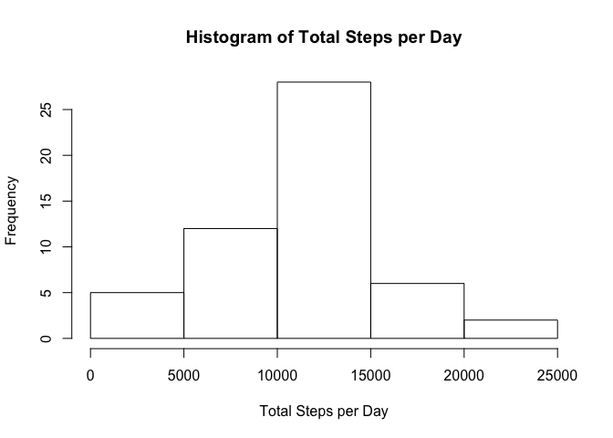
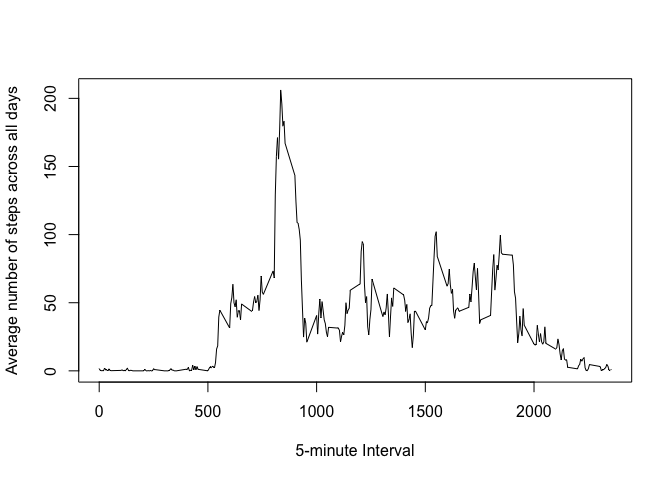
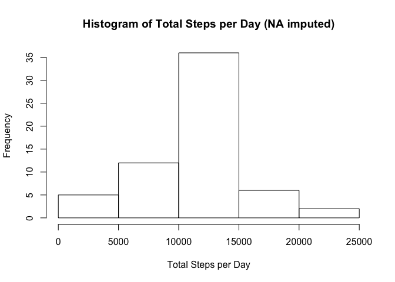
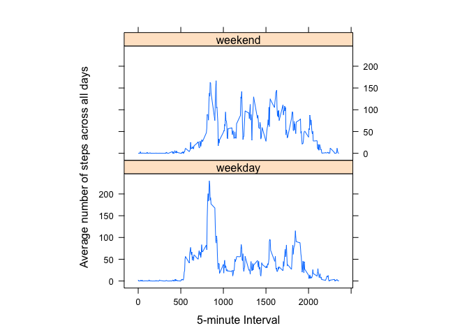

## Loading and preprocessing the data

Please note that I manually unzipped the archive that is part of the forked git repository and just load the csv file here.


```r
activity <- read.csv('activity.csv')
```

## What is mean total number of steps taken per day?

To calculate the mean and plot the histogram of the total number of steps per day, I first aggregate the activity data by date with the `sum` function. Since the date is already a day string and well-formatted, there is no further preprocessing needed. Missing values are removed with `complete.cases` as per the assignment brief.


```r
activityComplete <- activity[complete.cases(activity), ]
totalStepsPerDay <- aggregate(activityComplete["steps"], by=activityComplete["date"], sum)
hist(totalStepsPerDay$steps, main = "Histogram of Total Steps per Day", xlab = "Total Steps per Day")
```

<!-- -->


```r
meanTotalStepsPerDay <- mean(totalStepsPerDay$steps)
medianTotalStepsPerDay <- median(totalStepsPerDay$steps)
```

The mean and median of the total steps taken per day is **1.0766189\times 10^{4}** and **10765**, respectively.

## What is the average daily activity pattern?

For the time series plot, I first aggregate the steps by interval with the `mean` function.


```r
averageStepsPerInterval <- aggregate(activityComplete["steps"], by = activityComplete["interval"], mean)
plot(averageStepsPerInterval$interval, averageStepsPerInterval$steps, type = "l", xlab = "5-minute Interval", ylab = "Average number of steps across all days")
```

<!-- -->


```r
maxAverageSteps <- averageStepsPerInterval[which.max(averageStepsPerInterval$steps),]
```

The 5-minute interval **835** contains the maximum number of steps on average across all days.

## Imputing missing values

### Calculate and report the total number of missing values


```r
numberOfNARows <- sum(is.na(activity$steps))
```

There is a total number of **2304** rows with missing data.

### Devise a strategy for filling in all of the missing values

I choose the strategy where I replace `NA` with the mean number of steps for that particular 5-minute interval. That way I can reuse my `averageStepsPerInterval` data set. Let’s put this logic into a function.


```r
averageStepsForInterval <- function(interval) {
  averageStepsPerInterval[averageStepsPerInterval$interval == interval,]$steps
}
```

### Create a new dataset with the missing data filled in


```r
activityFilled <- activity
for (i in 1:nrow(activityFilled)) {
  if (is.na(activityFilled[i, ]$steps)) {
    activityFilled[i, ]$steps <- averageStepsForInterval(activityFilled[i, ]$interval)
  }
}
head(activityFilled)
```

```
##       steps       date interval
## 1 1.7169811 2012-10-01        0
## 2 0.3396226 2012-10-01        5
## 3 0.1320755 2012-10-01       10
## 4 0.1509434 2012-10-01       15
## 5 0.0754717 2012-10-01       20
## 6 2.0943396 2012-10-01       25
```

### Make a histogram and calulate mean and median


```r
totalStepsPerDayFilled <- aggregate(activityFilled["steps"], by=activityFilled["date"], sum)
hist(totalStepsPerDayFilled$steps, main = "Histogram of Total Steps per Day (NA imputed)", xlab = "Total Steps per Day")
```

<!-- -->


```r
meanTotalStepsPerDayFilled <- mean(totalStepsPerDayFilled$steps)
medianTotalStepsPerDayFilled <- median(totalStepsPerDayFilled$steps)
```

The mean and median of the total steps taken per day is **1.0766189\times 10^{4}** and **1.0766189\times 10^{4}**, respectively.

The mean is the same as before which makes sense since we take the mean number of steps for each 5-minute interval. That does not skew the overall mean of total steps per day. The median is now equal to the mean due to the evening out effect of adding steps that are a mean themselves.

## Are there differences in activity patterns between weekdays and weekends?


```r
activityFilled$day <- as.factor(ifelse(weekdays(as.Date(activity$date)) %in% c("Saturday", "Sunday"), "weekend", "weekday"))
```


```r
stepsIntervalPerDay = aggregate(steps~interval+day, activityFilled, mean)
library(lattice)
xyplot(steps~interval|factor(day), data=stepsIntervalPerDay, aspect=1/2, type="l", xlab = "5-minute Interval", ylab = "Average number of steps across all days")
```

<!-- -->
